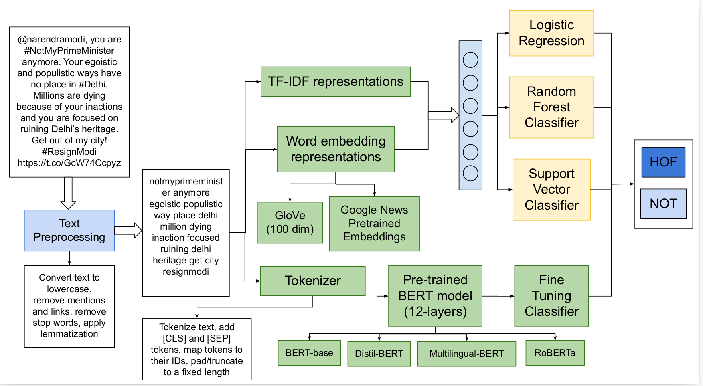

# Applying Transfer Learning using BERT-based models for Hate Speech Detection

Hateful and Offensive speech is rising along with social media. This issue has motivated researchers
to devise novel approaches which perform better than the traditional algorithms. This paper presents
the methods adopted by the BITS Pilani team for Subtask 1A of the Hate Speech and Offensive Content
Identification in English and Indo-Aryan Language task proposed by the Forum of Information Retrieval
Evaluation in 2021. We have used data augmentation to make the models generalize better. We have
experimented with different feature extraction techniques along with machine learning algorithms. But,
fine-tuning the pre-trained BERT-based models using transfer learning gave us the best results for all the
given languages on the test set. We got the highest Macro-F1 of 0.7993 for the English Language, 0.7612
for the Hindi Language, and 0.8306 for the Marathi Language using the pre-trained BERT-based models.

### Flowchart
 

Please refer to the [Report](Report.pdf) for implmentation details and results.

*Submitted at Forum for Information Retrieval Evaluation, 2021.*

